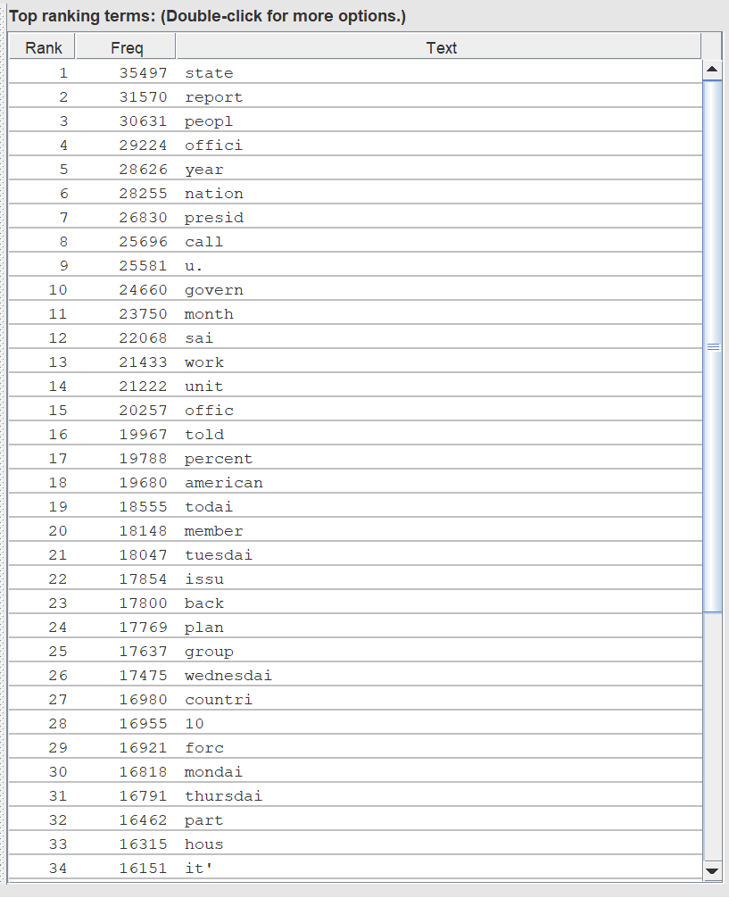
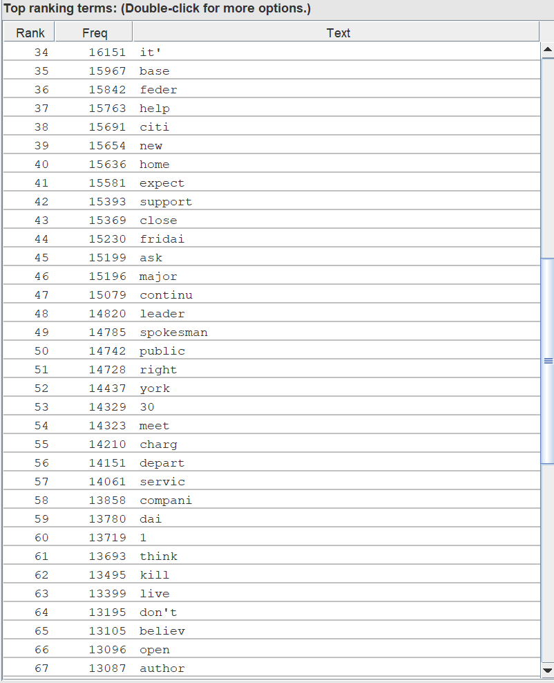

# Information Retrieval System

This project is an infomation retrieval system built using Apache Lucene.

## Group Information

**Students:**

- Ishan Phadte 300238878
- Lauren Gu 300320106
- Angus Leung 300110509

**Division of Work:**

- Ishan Phadte: Part 1 & Part 2
- Lauren Gu: Part 3 and Apache Lucene Implementation
- Angus Leung: Part 2

## Prerequisites

- Java Development Kit (JDK)

## Instructions

Final Code can be found at https://github.com/laurgu/CSI4107_A1

Initial Fork from https://github.com/IshanPhadte776/CSI4107

1. **Clone the repository:**

   ```bash
   git clone https://github.com/laurgu/CSI4107_A1.git
   ```

2. **Build the project using gradle wrapper:**

   ```bash
   ./gradlew build
   ```

   **_Or using gradle if installed:_** `gradle build`

3. **Build the index:**

   ```bash
   ./gradlew runLuceneIndex
   ```

   **_Or if gradle installed:_** `gradle runLuceneIndex`

4. **Run the the search function using gradle wrapper:**

   ```bash
   ./gradlew run
   ```

   **_Or using gradle if installed:_** `gradle run`

5. **To view results, navigate to app directory then open the Results.txt file:**

   ```bash
   cd app

   notepad Results.txt
   ```

## Functionality

### Part 1

1. **Jsoup Parsing:** The files in the coll folder are read using Jsoup which allows ill-formatted xml files to still be parsed.

2. **Document Extraction:** The seperate documents in each file are extracted by identifying \<DOC> tags. The \<DOCNO> and \<TEXT> of each document are extracted. <TEXT> is converted to lowercase to allow stopwords to be properly removed in the following section.

3. **Preprocessing:** The documents are preprocessed using a custom analyzer that extends the analyzer class provided by Lucene.
   It tokenizes words and removes stopwords and a port stemmer is used.

### Part 2

The index is created using Lucene's "Index Writer". This index is written to a file where it can be reused for different queries.

### Part 3

1. The query string is preprocessed using the custome analyzer, like how documents are preprocessed in Part 1.

2. Querying is done using Lucene's "Index Searcher" to search the index build in Part 2. It retrieves the top 1000 results for a given query and these results are written to a txt file.

### Data Structures

Several data structures were used to organize data in our project.

In LuceneIndex.java:

- `HashMap<String, String> docData`: used to store the docId and corresponding text of all documents
- `HashMap<String, String> allDocData`: used to accumulate the docData from all XML documents in the coll folder

In CustomeAnalyzer.java:

- `HashSet<String> customStopWords`: used to store custom stop words loaded from Stopwords.txt

In App.java:

- `ArrayList<String> allResults`: used to store the results of the queries in a list
- `CustomAnalyzer customAnalyzer`: an instance of the CustomAnalyzer class which is used for creating query parser with customized preprocessing. The query parser is used for parsing the query string and generating Lucene queries based on the string.

### Vocabulary and Tokens

Lucene create a folder `CSI4107_A1\app\index_dir` for it's index that contains he inverted index structure, which includes information about terms, their positions, and other metadata. These files are in binary and other Lucene specfic file formats. It can be interpreted using a software called Luke to view the actual terms in the index. Below is a preview of the tokens in the index, displayed in Luke.






In totaly the vocabulary had 185530 terms.

### Results

Below are screenshots of our first 10 results for queries 1 and 25.


_Query 1: 'Coping with overcrowded prisons' Results_


_Query 25: 'NRA Prevention of Gun Control Legislation'_

From result screenshots, we note that the scores are overall significantly higher for query 25 compared to query 1 indicating that the system found documents more relevant to query 25 than query 10.

Compared to the expected results, below, ours quite different. It's quite possible that our system identified documents as relevant because the words the query and document had in common are rare. This seems to be the case for query 1's first result which contains the word overcrowded, a word not present in the top 100 most frequently occuring words.


_Query 1: Expected Results_


_Query 25: Expected Results_

We evaluated the performance of our system using trev_eval and expected search results document provided. Below are screenshots of our results.


Based on the trec_eval report, we conclude:
- Mean Average Precision (MAP): We achieved a 0.2998/1 which could be improved with future fine tuning of the system
- Reciprocal Rank: We achieved a 0.5813/1 which is decent and indicates relatively efficient retrieval of documents
- Precision at various cutoffs (P_5, P_10, P_20, etc.): We notice our measures are decent with fewer documents but drop when the cutoff increases 
- R-Precision: We achieved a 0.2982/1 which is low and indicates the system struggled to indentify relevant documents
- Binary Preference: We achieved a bpref score of 0.3397/1.0, indicating a reasonable ability of our system to rank relevant documents higher than non-relevant ones
- Interpolated Precision: We observe varying precision values at different recall levels, indicating the system's ability to maintain precision as the recall increases however as recall largely increases, precision drops off indicating the system trades precision for recall
  
### Optimizations

Initially, we implemented our IR system using the tf-idf weighting system. For comparison we implemented this Lucene version and found it seemed to produce more accurate results without significantly impacting the runtime. To improve the quality of results, we used port stemming which we found improved our trec_eval scores in every measure in the produced report.
