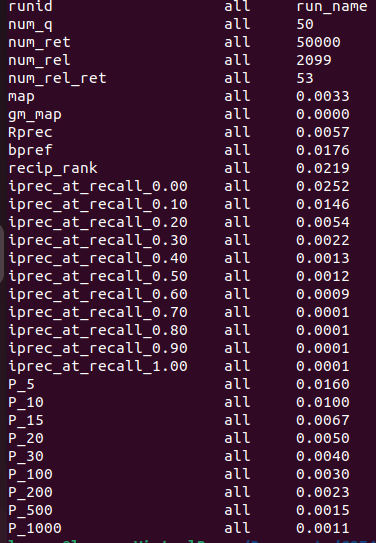
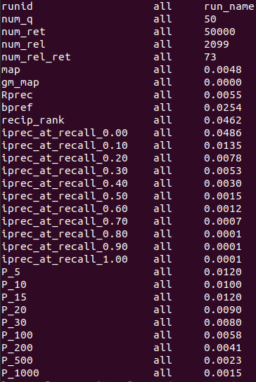
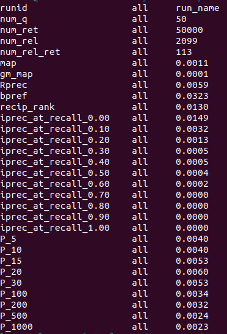
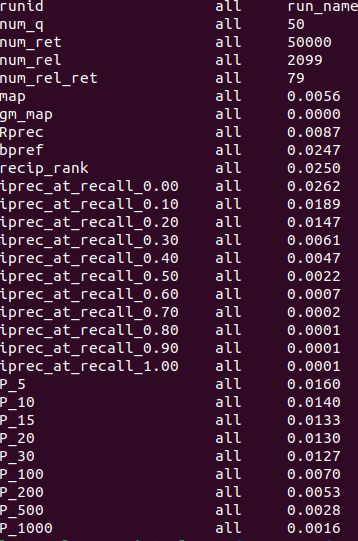
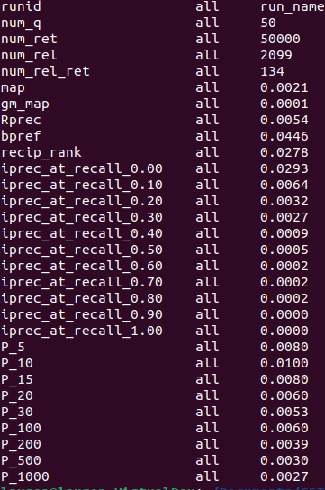
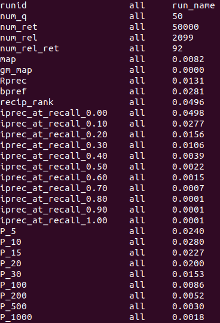
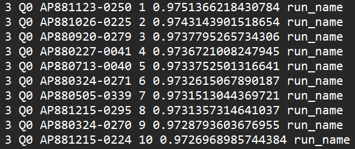
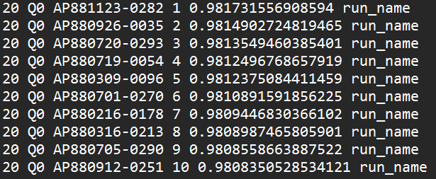

# Assignment 2

This project uses BERT and doc2vec models to create information retrieval systems.

## Group Information

**Students:**

- Ishan Phadte 300238878
- Lauren Gu 300320106
- Angus Leung 300110509

**Division of Work:**

- Ishan Phadte: BERT
- Lauren Gu: Report, BERT and Doc2Vec edits
- Angus Leung: Doc2Vec, BERT

## Instructions

Install dependencies by executing:

```bash
python install_dependencies.py
```

### BERT

Run BERT using:

```bash
python BERT.py
```

Results can be found in a document called "BERT_results.txt"

### Doc2Vec

Run Doc2Vec using:

```bash
python Doc2Vec.py
```

Results will be found in a document called "doc2vec_results.txt"

## About the Models

### BERT

BERT (Bidirectional Encoder Representations from Transformers) is a pretrained model that utilizes unsupervised learning techniques. During pretraining, it is trained to predict words based on their surrounding context and to determine whether two sentences follow each other in a text. BERT considers the context to the left and right of a word making it bidirectional. This allows it to capture rich semantic relationships.

BERT encodes text using two main mechanisms:

1. Self-Attention Mechanism: This mechanism allows BERT to weigh the importance of each word of an input based on its context. It applies these weightings to all words in a sequence capturing long-range relationships between words.

2. Feed-Forward Mechanism: After processing the input sequence through self-attention layers, BERT applies feed-forward neural network layers to further refine the representations learned from the self-attention mechanism. These layers apply nonlinear transformations to the weighted representations.

After training, BERT can be used to generate word embeddings that capture the semantic meaning and importance of words in their context. The resulting embeddings can be used to retrieve relevant documents.

### Doc2Vec

Doc2Vec:

Doc2Vec is an unsupervised learning model that generates vector representations of text. There are two variations of Doc2Vec: distrbuted memory (DM) and distributed bad of words (DBOW). In this project, we use the ditributed memory version, so this introduction will focus on this implementation. The DM variant learns to predict what a word should be based on its context in a paragraph and the paragraph vector. Doc2Vec is trained by iterating over the corpus several time. Each iteration, it learns the context of words. To retrieve documents, Doc2Vec applies the training to predict a vector embedding of the query and documents then uses, in our implementation, the cosine similarity between the documents and vectors to identify relevant documents.

## Functionality

### Parsing

Before the information retrieval systems may be used, the documents and queries are preprocessed. The seperate documents in each file are extracted by identifying \<DOC> tags. The \<DOCNO> and \<TEXT> of each document are extracted.

### BERT

#### **Preprocessing**

To prepare documents and queries for retrieval with the BERT model, preprocessing removes punctuation and stopwords applies porter stemming, and converts text to lowercase. Documents are tokenized using BertTokenizer from the transformers library. The tokens list must be 510 tokens long, so lists longer than this are truncated and lists shorter than this are padded.

We use the pretrained tiny bert model "prajjwal1/bert-tiny" which is a derivative of the original Google BERT model that is more lightweight as we found using the original BERT model produced runtimes that were too long. The model creates embeddings of both the documents and queries. To reduce runtime, these embeddings are then saved locally so that future runs may load the document and query embeddings rather than recalculating them.

#### **Retrieval**

To retrieve documents, we calculate the cossine similarity between the the embeddings created in preprocessing are rank the documents from most to least similar.

### Doc2Vec

#### **Preprocessing**

To prepare documents and queries for retrieval with the BERT model, preprocessing removes punctuation and stopwords applies porter stemming, and converts text to lowercase. Text is then tokenized using nltk word_tokenize().

The default Doc2Vec definition is:

```bash
model = Doc2Vec(window=10, alpha=0.01, workers=4)
```

The Doc2Vec model parameters we changed are:

```bash
model = Doc2Vec(window=10, alpha=0.01, workers=4)
```

where the vector_size dictates the dimensionality of the output vectors for documents and queries, and epochs specifies the number of iterations over the corpus the model is to do during training. We save the model locally so that it does not need to be retrained each run in order to reduce runtime.

The model is trained using on the documents from the corpus where it learns to generate embeddings for documents and words so that similar documents have similar embeddings in vector space. While ideally, a model should learn on training data and be tested on seperate testing data, in this particular case, it was not possible to use different data for testing and training as we were only given one collection of documents. However, it is generally not acceptable to use the same data for testing and training as this will produce inflated positive retrieval results.

#### **Retrieval**

To retrieve documents, Doc2Vec will use what it has learned during training to infer an embedding of a document and a query. We save the vector embeddings for the documents and queries so that subsequent runs do not have to recalculate these embeddings, reducing runtime. The cosine similarities between a query and the document infered vectors are calculated to determine relevant documents.

## Data Structures

### BERT

1. **Lists**: lists are used many times to store things like "tokens", "input_ids", and the "attention_mask"

2. **Dictionaries**: are used to store the document and query embeddings. The embeddings are mapped to their id; the docno for the documents and a number dictating query order for queries.

3. **Numpy Array**: are used to store the embeddings into local files so they may be retrieved in subsequent runs. The numpy array allows for efficient storage and retrieval of large datasets.

4. **Torch Tensor**: are used to handle input tensors and attention mask tensors during the encoding process.

### Doc2Vec

1. **Lists**: are used to store several things, like the tagged documents, and the list of queries to be excuted.

2. **Dictionaries**: are used to store the vectors calculated for the documents and queries. The vectors are mapped to an id; the docno for the documents and a number dictating query order for queries.

3. **File I/O**: json files are used to store the document and query vectors that are calculated

## Optimizations

### BERT

Optimizations we used for BERT were mainly aimed towards reducing runtime as the runtime initially (4hrs per query) was so long that it was hard to test different variations. In order to reduce runtime, we used a tiny BERT model rather than the original BERT model as it is lighterweight and reduces the runtime. Additionally, we found that the longest part of the BERT runtime was creating the embeddings for the documents and tokens. Becuase we are working with a static set of documents and tokens, we decided to initally compute all the embeddings then save them locally so that future runs could simply load the embeddings rather than having to recalculate them.

### Doc2Vec

Similar to BERT, we also tried to reduce the runtime of Doc2Vec so it could be run numerous times without taking an unreasonable amount of time. We followed a similar approach by saving the model after it is trained once and saving the document and query vectors after they are calculated so subsequent runs could load in a pretrained model and use the precalculated vectors.

In order to try to improve MAP, preceision, and recall scores, we tried changing the vector_size and epochs variables. We found that increasing either actually yielded worse results

## Results and Analysis

To evaluate the performance of the models, we will use trec eval and we will compare runtimes. Since runtimes may vary greatly depending on the hardware and what else is running on the computer at the time, we will take the average runtime of three runs.

### BERT

### Doc2Vec

Unfortunately, we do not have screenshots of the Trec Eval scores where we initially varried the epochs and vector_size parameters of the model but we eventually devided the default values, epochs = 10, vector_size = 100, yielded the best results. A screenshot of a model using all default parameters is picrued below:

_Default Doc2Vec Model Trec Eval Results_



Because the results of this model were very poor, we decided to try changing some other variables as well. The Trec Eval results of those experiments are below:

_Doc2Vec model with window = 10 and all other parameters as default Trec Eval Results_



_Doc2Vec model with window = 15 and all other parameters as default Trec Eval Results_



_Doc2Vec model with alpha = 0.01 and all other parameters as default Trec Eval Results_



_Doc2Vec model with alpha = 0.01 and all other parameters as default Trec Eval Results_



After trying the variations of Doc2Vec above, we concluded the best performing model used default parameters except for alpha = 0.01 and window = 10. The results of our final version of Doc2Vec are pictured below.



Below is a table summarizing the MAP and P@10 scores of the different versions we tried:

| Version                   | MAP    | P@10   |
| ------------------------- | ------ | ------ |
| Default Parameters        | 0.0033 | 0.0100 |
| Window = 10               | 0.0048 | 0.0100 |
| Window = 15               | 0.0011 | 0.0040 |
| Alpha = 0.01              | 0.0056 | 0.0140 |
| Alpha = 0.001             | 0.0021 | 0.0100 |
| Alpha = 0.01, Window = 10 | 0.0082 | 0.0280 |

---

The top 10 results from queries 3 and 20 produced by this model are pictured below:

_Top 10 Results of Query 3_



_Top 10 Results of Query 20_



---

The average runtime for training the model and calculating the embeddings of three runs is shown below:
$$ (1070.8643760681152s + 1107.1787784099579s + 1054.4542322158813s)/3 = 1077.4991288979848s$$

The average runtime for retrieving and writing results of the three runs is shown below:
$$ 1483.1126646995544s + 1421.1524877548218s + 1581.267713546753s)/3 = 1495.1776220003764s $$

Because we save the model and embeddings after a run which are loaded into subsquent runs, when the model and embeddings do not need to be recalculated, it takes only a few seconds to load from file the trained model and the precalculted embeddings.

---

From the Trec Eval Results above, we observe that Doc2Vec has overall poor performance. The map score (mean average precision) is very low, at 0.0082, meaning the model struggled to retrieve relevant documents. Similarily, the Rprec (R precision) is low, at 0.0131, indicating that a various levels of recall, precision of the model is generally poor. The precision at K scores also reflect Doc2Vec's struggle to retrieve relevant documents. The precision at recall levels scores show a sharp drop off as recall increases, indicating that the system retrieves more and more irrelevant documents as recall increases.

From the runtimes, we not that they are not especially long, with training and calculating vectors taking about 1077.4991288979848 seconds (about 18 minutes) while retriving and writing results takes about 1495.1776220003764 seconds (about 25 minutes)for a total time of about 2572.6767508983612 seconds (about 43 minutes).

### Comparison to A1

For A1, we implemented an IR system using Apache Lucene. Below are all three trec eval results.

_Apache Lucene Trec Eval Results Screenshot_


From the trec eval results, we observe that the Apache Lucene model far outperfroms both the BERT and Doc2Vec implementations of an IR system.

We also compare the runtimes of the three models. Below is a table sumarrizing our findings:

Again, we notive that the Apache Lucene outperforms BERT and Doc2Vec, having significantly shorter runtimes.

From this, we conclude that
